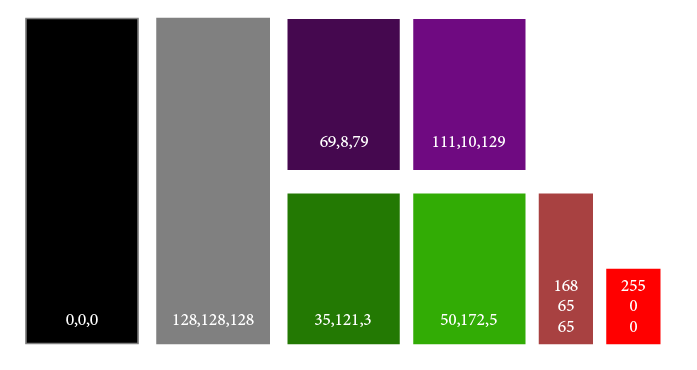
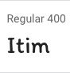
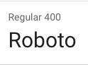
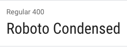
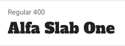
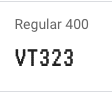

# Corona Spin

This game is an adaptation of the tradicional slot-machine games with a corona virus tematic. In Corona Spin, each slot is considered to be an action. The order of these actions is very importat to the final score of the game.

The website has three sections: How to play, New game and Leaderboard. 
In the how to play section you can find an explanation for the main idea of the game, as well as information about your initial score and how to multiply your bet. This section also shows the function of each action that can appear in the game.

In the New game tab is where we can find the slot machine. In here, there are three slots that will change after each spin. Each spin has a cost of 2 points, but this can be multiplied by the bet multiplier buttons. The slot machine shows 2 scores: the one at the left shows the result of the last spin, and the one on the right the player's score. At the bottom, you can also find 2 more buttons: restart and put this score on the leaderboard. The restart button will refresh the page, and you start your game from the beginning. If you chose to put your score on the leaderboard, the game will end and you will be redirected to the leaderboard page, which will have your name and score added.

The leaderboard section is a local scoreboard that uses the local storage to rank the results of the games played on that browser. If no game was played, it only shows some fantasy initial score information.
 
## UX


### PROJECT IDEA: Corona Spin Game
The users of this website are gamers, curious about casino games or simply people in quarentine. 

### STRATEGY PLANE

This is a typical slot machine game we can find in regular casinos. The main difference is that it uses themes related to the COVID-19 pandemic and the combinations can save or kill the player. This will be set in a fun way to remind players of the daily precautions we need to take to avoid the virus spread. 

Users with some free time in this time of pandemic can spend some time to see if they are lucky, have some fun as we reinforce the measures to be taken during these hard times.

Basic website objectives:
- Reinforce good actions about the pandemic in a fun way
- Attract younger people to talk about social responsibility
- Bring amusement
- Give the opportunity to curious people to see how a slot machine works

User needs:
- People in quarentine get bored and look for entertainment
- People in quarentine get extra time and look for time killers
- Gamers interested in a new way of playing with a slot machine
- Parents looking to bring the COVID-19 social information for their children
- Curious people that would like to know how to play in a slot machine

### SCOPE PLANE

Functions:
- Spinning slot machine with 3 slots
- Matching one of the possible right combinations gives you points
- Matching the wrong combinations gives you nothing
- The cost 2 points per spin can be multiplied
- Adding score into local leaderboard

Features:
- COVID-19 related slot-images
- Player's name
- Player's initial score
- Leaderboard
- How to Play section

Slots:
- Washing hands
- Cough
- Alcohol
- Hand to face
- Not respecting social distance
- Mask

Future implementation
- Customise slots
- Set a custom joker to your game
- Set a personal bonus combination
- Set an online leaderboard


### STRUCTURE PLANE

Find Here the wire frames for the information architecture:

[Wireframes](https://fergabi17.github.io/corona-spin/resources/wireframes/wireframes.html)

### SKELETON PLANE

Website main colors:



Website fonts:







### SURFACE

Find the project live on https://fergabi17.github.io/corona-spin/

User Stories:
- A user doesn't know how to play: they can access the "How to play" section from any page in the website
- A user wants to know more about a specific action, they can access the "How to play" section from any page in the website
- A user wants to start a new game: the new game page is the inicial page in the website. If the user navigates to other pages, they can always start the game clicking on the "New Game" tab - accessible from any page in the website
- A user wants to check out their previous points, they can access the leaderboard tab
- A user wants to multiply their bet, they can click any of the multiplier buttons at the bottom of the game page
- A user wants to restart their game from the beggining, they can click restart game at the bottom of the game page
- A user wants to end game and put their score on the leaderboard, they can use this button at the bottom of the game page
- A user wants to know more about the game developper, they can find this information in the footer of all pages

## Technologies Used

- [Html](https://html.com)
    - The project uses HTML5, standard markup language for creating Web pages.

- [CSS](https://www.css3.info)
    - The project uses CSS to style the website.

- [BOOTSTRAP](https://getbootstrap.com)
    - The project uses the grid system from BOOTSTRAP to get the website responsive.

- [Google Chrome](https://www.google.com/chrome/)
    - This project used google CHROME browser and its developer tools.

- [Mozilla Firefox](https://www.mozilla.org/en-US/firefox/new)
    - This project used MOZILLA FIREFOX browser.

- [Safari](https://www.apple.com/safari/)
    - This project used SAFARI browser.

- [Visual Studio Code](https://code.visualstudio.com/)
    - This project was built using Visual Studio Code IDE.

- [Git](https://git-scm.com/)
    - The project used GIT for Version Control.

- [GitHub](https://github.com/)
    - This project used GITHUB for files repository.

- [Am I Responsive](http://ami.responsivedesign.is)
    - This tool was used for testing the responsiveness of the website.

- [Html validator](https://validator.w3.org/nu/#textarea)
    - This tool was used to valide the website's HTML code.

- [Css validator](https://jigsaw.w3.org/css-validator/validator)
    - This tool was used to valide the website's CSS code.

- [Css gradient generator](https://cssgradient.io/)
    - The CSS gradient generator was used to easily create gradient transitions across the website.
    
- [Free sound](https://freesound.org/)
    - The Free Sound website was used as source for the sound effects of the slot machine.

- [Jasmine](https://jasmine.github.io/)
    - The project used JASMINE to correctly test the game functionalities.

## Testing

To make sure the slot machine score results are accurate as planned, automatic tests were made using Jasmine. The main function that was tested was the getScore(). This function takes as argument an array with 3 strings, the 3 actions comming from the slots result. This function returns the score in number format. This functionality was tested with all possibilities described in the code. No failures were presented in the specs.

You can check the live results in the [Jasmine_Tests](https://fergabi17.github.io/corona-spin/spec/gameSpec.html) section.

For manual tests, the following browsers were used:
- Google chrome (desktop and mobile)
- Mozilla Firefox
- Safari (desktop and mobile)

Manual tests included: 
- Functional links
- Links to other websites open on a new tab
- Information easily found
- Readability

The CSS and the HTML codes were validated on jigsaw.w3.org and validator.w3.org.

## Deployment

This project is hosted on [GitHub](https://github.com/fergabi17/corona-spin/)

The git repository contains:
 - README file
 - index.html - The New Game
 - how-to-play.html
 - game.html
 - leaderboard.html
 - assets folder contains:
    - css: game and website styles
    - js: game javascript functionality
    - images: game and website images
    - sounds: game sounds
 - resources contain:
    - UX: website's visual identity elements
    - wireframes: website's wireframes created during the structure plan
- spec contain a js file with tests for the slot machine, as well as the jasmine html page to show the tests results
 
To deploy a remote version of the website:
- Have git installed
- Visit the [repository]([GitHub](https://github.com/fergabi17/corona-spin/))
- Click 'Clone or download' and copy the code for http
- Open your chosen IDE (Cloud9, VS Code, etc.)
- Open a terminal in your root directory
- Type 'git clone ' followed by the code taken from github repository
    - ```git clone https://github.com/fergabi17/corona-spin/```
- When this completes you have your own version of the website
- The website can be run by opening one of the index.html file within a web browser


This website is hosted on github.com. To deploy your own version of the website:
- Create a repository on github called corona-spin
- On the repository page, click on settings
- Scroll until the GitHub pages section
- In the dropbox, select 'Master Branch' (or the branch you're using)
- Wait a few minutes and your website will be deployed at https://"YOUR_USER".github.io/corona-spin/

This website was developed in Visual Studio Code.

## Credits

### Media
- The slot machine drawings are creations from [Neemias_Aires](https://www.instagram.com/neemiasalencarts/)
- Images along the website are from [FreePik](http://freepik.com/)

### Acknowledgements

Websites consulted during the project developement. Those websites were used for reseach in the slot machine subject and functionality, as well as for coding references:
- [CSS-tricks](https://css-tricks.com/)
- [W3schools](https://www.w3schools.com/)
- [StackOverflow](https://stackoverflow.com/)
- [Oireachtas-ifd-project](https://github.com/Pattern-Projects/oireachtas-ifd-project/)
- [How-slot-machines-work](https://www.vegasslotsonline.com/work/)
- [Understanding-online-slots](https://www.onlinecasinos.net/how-online-slots-work/)
- [Local-leaderboard](http://test.johnwordsworth.com/quests/local-leaderboards.html)
- [Slot-machine-in-javascript](https://odhyan.com/blog/2011/05/slot-machine-in-javascript/)
- [CSS-push-buttons](http://cssdeck.com/labs/push-the-buttons)
- [Sorting-arrays-in-javascript](https://stackoverflow.com/questions/50415200/sort-an-array-of-arrays-in-javascript)

Thank you for mentoring and suport:
 - Code institute
 - Antonija Simic for our mentoring sections
 - Guilherme Vieira for all the patience in testing